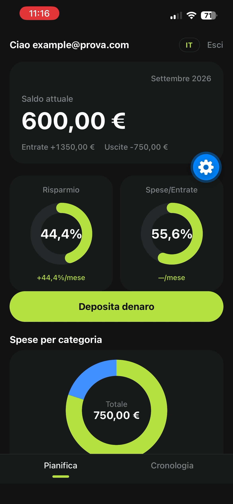
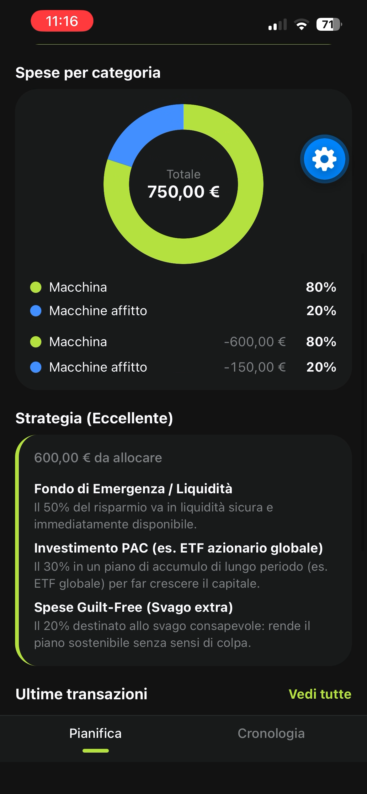
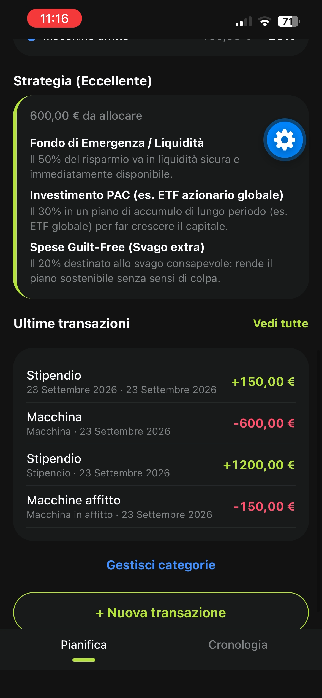
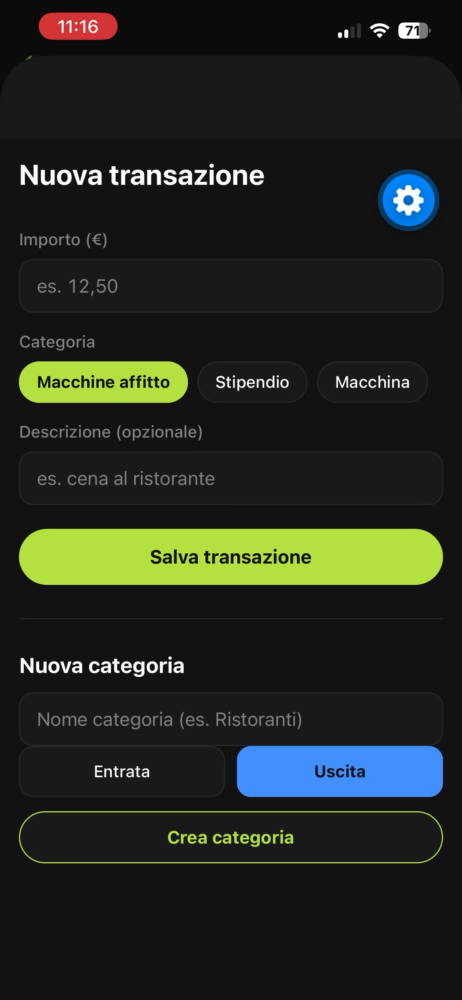

<p align="center">
  
</p>

<h1 align="center">Gestionale Fondi — PFM (Personal Finance Management)</h1>

<p align="center">
  <a href="https://github.com/dominiqueferrucci1-commits/gestionale-fondi-app/actions/workflows/ci.yml"></a>
  <a href="LICENSE"></a>
</p>

Applicazione full-stack per la **gestione di spese, entrate e strategie di accumulo di risparmio**.
Il progetto risolve un problema concreto: tenere traccia delle proprie finanze personali in modo strutturato (categorie, transazioni, riepilogo mensili) e ricevere un **consiglio automatico su come destinare il risparmio** del mese, in base alla strategia selezionata.

## Stack tecnologico

| Livello | Tecnologie |
|---|---|
| **Backend** | Python 3.11, FastAPI, SQLAlchemy 2.0, SQLite, Pydantic v2 |
| **Sicurezza** | JWT (access + refresh token), bcrypt, OAuth2 password flow |
| **Frontend** | Expo SDK 57, React Native 0.86, React 19, TypeScript |
| **Comunicazione** | REST API + axios |
| **Testing / QA** | pytest (17 test), typecheck TypeScript, GitHub Actions CI |
| **Tooling** | Uvicorn (dev server), Expo CLI |

## Struttura del repository

```
gestionale-fondi-app/
├── .github/workflows/ci.yml # CI: test backend + typecheck frontend
├── docs/                    # Logo e screenshot dell'interfaccia
├── pfm_backend/             # API REST FastAPI
│   ├── app/
│   │   ├── api/             # auth, categories, transactions, analytics, strategies
│   │   ├── core/            # config, sicurezza (JWT)
│   │   ├── services/        # motore di calcolo delle strategie
│   │   ├── models.py        # modelli SQLAlchemy (User, Category, Transaction)
│   │   ├── schemas.py       # schema Pydantic (validazione request/response)
│   │   ├── database.py      # connessione SQLite
│   │   └── main.py          # istanziazione FastAPI e router
│   ├── tests/               # test pytest (auth, categorie, transazioni, analytics)
│   ├── requirements.txt
│   ├── requirements-dev.txt
│   └── .env.example         # template delle variabili d'ambiente
└── pfm_frontend/            # App mobile Expo / React Native
    ├── App.tsx              # punto di ingresso (rotta auth ↔ home)
    ├── src/
    │   ├── api.ts           # client axios configurabile
    │   ├── types.ts         # tipi TypeScript condivisi
    │   └── screens/         # AuthScreen, HomeScreen
    ├── app.json             # configurazione Expo
    └── package.json
```

## Funzionalità

- **Autenticazione**: registrazione, login, refresh token, profilo utente (`/auth`)
- **Categorie**: CRUD completa per organizzare entrate e spese (`/categories`)
- **Transazioni**: inserimento, modifica, eliminazione e storico delle operazioni (`/transactions`)
- **Analytics**: riepilogo mensile e suddivisione per categoria (`/analytics`)
- **Strategie di accumulo**: raccomandazione automatica per il risparmio (`/strategies`)
- **App mobile**: schermata di accesso (login/registrazione) e area personale con riepilogo del mese, consigli di investimento, inserimento ed eliminazione delle transazioni

### Endpoint principali

| Metodo | Endpoint | Descrizione |
|---|---|---|
| POST | `/auth/register` | Registrazione nuovo utente |
| POST | `/auth/login` | Login (restituisce token JWT) |
| POST | `/auth/refresh` | Rinnovo del token di accesso |
| GET | `/auth/me` | Profilo utente corrente |
| GET/POST | `/categories` | Lista / creazione categorie |
| PUT/DELETE | `/categories/{id}` | Modifica / eliminazione categoria |
| GET/POST | `/transactions` | Lista / creazione transazioni |
| PUT/DELETE | `/transactions/{id}` | Modifica / eliminazione transazione |
| GET | `/analytics/monthly` | Riepilogo del mese corrente |
| GET | `/analytics/by-category` | Spese raggruppate per categoria |
| GET | `/strategies/recommendation` | Raccomandazione strategia di accumulo |

## Anteprima dell'interfaccia

| | |
|---|---|
|  |  |
|  |  |
|  | |

## Come eseguire il progetto in locale

### Prerequisiti

- Python 3.11+
- Node.js 18+ (con npm)
- Git

### 1. Backend

```bash
cd pfm_backend

# Ambiente virtuale
python -m venv venv
venv\Scripts\activate          # Windows
# source venv/bin/activate     # macOS/Linux

# Dipendenze
pip install -r requirements.txt

# Variabili d'ambiente
copy .env.example .env         # Windows (cp .env.example .env su macOS/Linux)
# Apri .env e inserisci una SECRET_KEY casuale

# Avvio del server (http://127.0.0.1:8000)
uvicorn app.main:app --reload
```

Documentazione interattiva dell'API: <http://127.0.0.1:8000/docs>

### 2. Frontend

```bash
cd pfm_frontend

# Dipendenze
npm install

# Avvio del dev server Expo
npm start
```

Da lì puoi scansionare il QR code con **Expo Go** (Android/iOS) oppure premere `w` per la versione web.

> **Dispositivo fisico**: l'app contatta il backend su `http://127.0.0.1:8000` di default.
> Se usi un telefono reale, avvia Expo con l'IP della tua macchina:
> `EXPO_PUBLIC_API_URL=http://192.168.1.X:8000 npm start`

## Test e integrazione continua

```bash
# Backend - 17 test (auth, categorie, transazioni, analytics/strategie)
cd pfm_backend
pip install -r requirements-dev.txt
pytest -v

# Frontend - controllo dei tipi TypeScript
cd pfm_frontend
npm run typecheck
```

Ogni push sulla branch `main` e ogni pull request attiva la **GitHub Actions CI**
(`.github/workflows/ci.yml`), che esegue pytest e il typecheck TypeScript in automatico.

## Variabili d'ambiente

| Variabile | Descrizione | Default |
|---|---|---|
| `SECRET_KEY` | Chiave segreta per firmare i JWT | *se assente ne viene generata una effimera (con warning)* |
| `DATABASE_URL` | URL del database | `sqlite:///./pfm_app.db` |
| `ALGORITHM` | Algoritmo di firma | `HS256` |
| `ACCESS_TOKEN_MINUTES` | Durata access token | `30` |
| `REFRESH_TOKEN_DAYS` | Durata refresh token | `7` |
| `EXPO_PUBLIC_API_URL` *(frontend)* | Base URL dell'API | `http://127.0.0.1:8000` |

> ⚠️ Il file `.env` **non viene committato** ed è presente nella `.gitignore`: ogni sviluppatore ne crea uno proprio a partire da `.env.example`.

## Licenza

Distribuito sotto licenza [MIT](LICENSE) — Copyright © 2026 Dominique Ferrucci.
